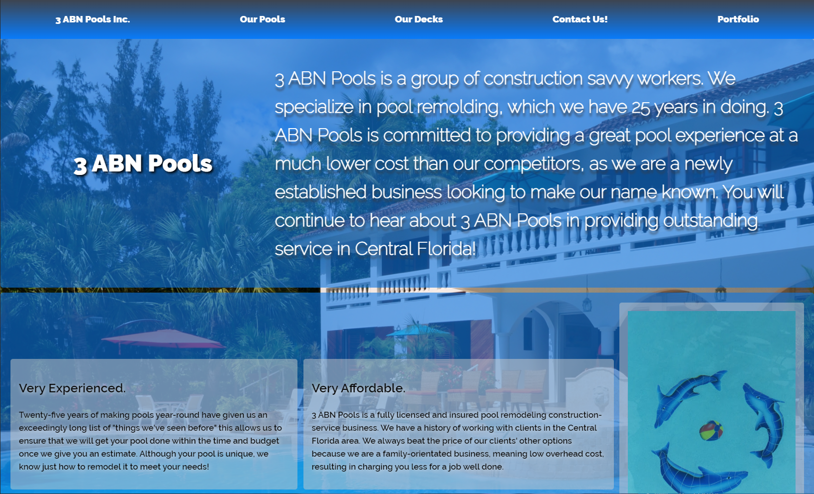
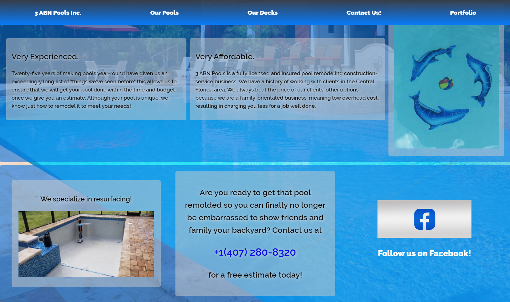
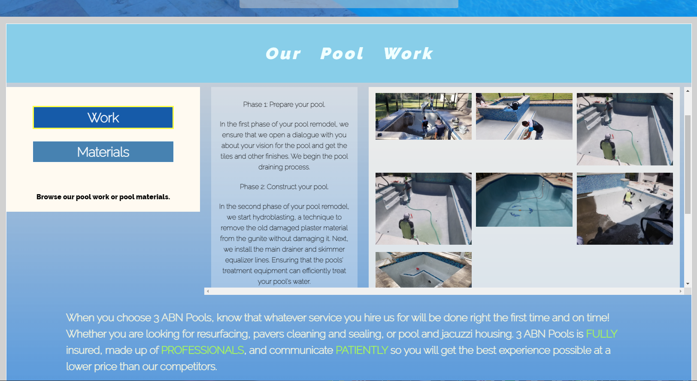
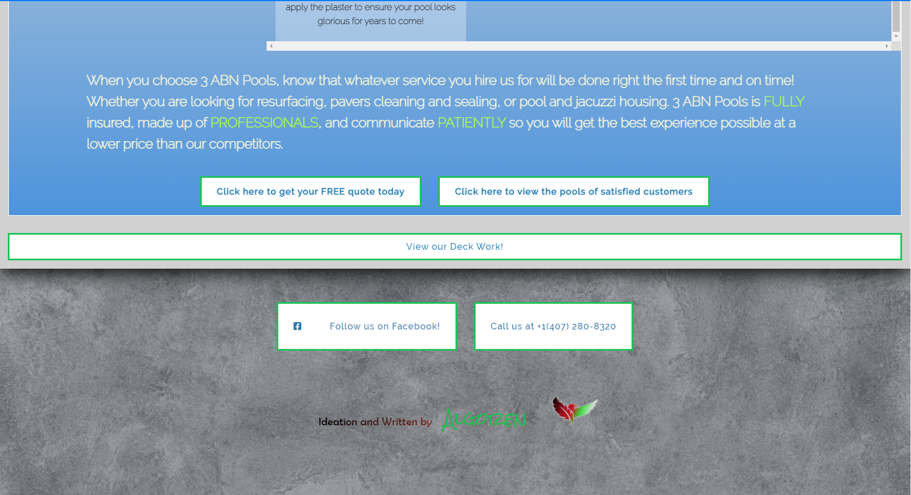
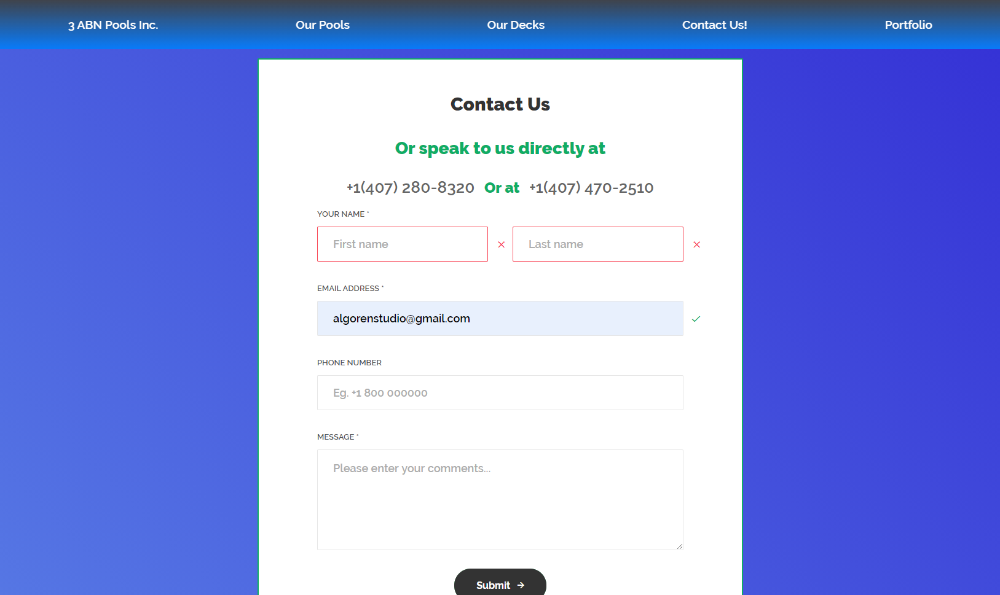

# Be One, Be Different (Pool-Service-Website)

A Paid Commission Site for a friend. A basic but necessary first steps for launching a service business. This is a website for a pool service company in, Orlando, one of Florida's most sought out vacation destinations.

## Introduction - The Seemigly Opposite Venture

In efforts, to produce a website that may be used as a template design for service based companies such as a pool construction business websites. The purpose of this template is to make a service based website be able to do 'seperation of concerns' in seperating the kinds of services they offer on their website and the ability to seperate those services futher. For example, into the 'Work' they do and/or 'Materials' they use during the servicing. To keep consistent interaction and layout through out the pages is vital in ensuring the user does not get confused in the traversing of the site as older and less technology savy users may be the ones interacting with the site.

The reason I created this is to challenge myself to create a simple but effective website design that is uniquely different from the typical mold of websites commonly seen on the market. Making it familiar but unique, a seemingly opposite venture, but a valuable undertaking.

## Technologies - The Very Basics

The project is created with:

- HTML
- CSS3
- JavaScript
- jQuery
- Firebase
- CSS Grid
- Flexbox

In summary:
I used the very basic technologies, the backbones of the web, HTML, CSS, Javascript. I used only one library good ol' jQuery for some event handling. The most advance of the technologies are my use of CSS Grid, more specifically grid-template-rows and grid-template-columns, my first time using it in production. I also used flexbox and Firebase for contact form back-end handeling.

## Launch - 3ABNPOOLS.com

The website is now currently live at www.3abnpools.com. Feel free to check it out and if you experience any bugs please report them to algorenstudio@gmail.com or eduardo@3abnpools.com. Thank you.

## Screenshots

## Status

THe status of this project is completed but on going improvements are being done, mostly in terms of SEO and site optimization.

## Contributors

The contact form is based from Contact Form v14 from colorlib. You can find a link to the form template I used here [Contact Form v14](https://colorlib.com/wp/template/contact-form-v14/ "Colorlib's Contact Form v14")

I would like to especially thank Rachel Andrew, the author of gridbyexample.com a fantastic site for learning CSS grid in a straightforward way, by the use of examples. Gridbyexample was my go to on deepening my understanding of CSS grid during this project.

The Masonry Gallery was provided by Rahual Arora, Src: https://w3bits.com/css-grid-masonry/. Though I did not use this feature how I intended to it was still fun trying to understand how such a feature works.

I would finally like to thank Austin Paquette for creating an amazing and easy to implement Parallax Footer. You can find his Codepen to footer here: https://codepen.io/pqt/pen/bNByOj

## Team

|  |
| ----------------------------------------------------------------------------------------------------------------- |

[**AlgoRen** (Jerome)](https://https://github.com/AlgoRen)
